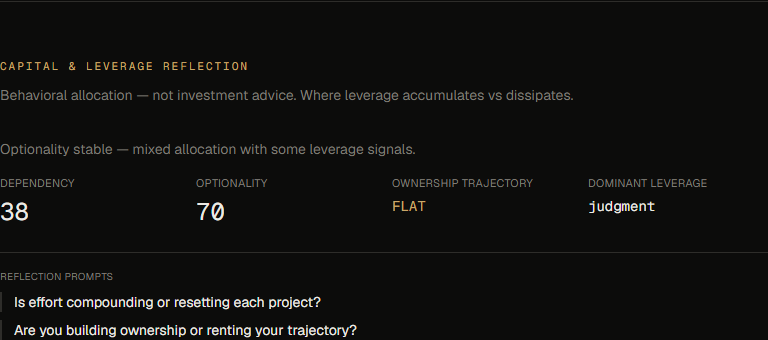
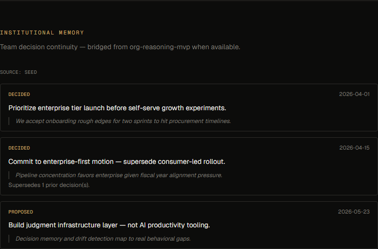

# trajectory-native

**Trajectory / judgment / coordination infrastructure.**  
Help humans and organizations **compound judgment, ownership, and long-term trajectory** in the AI era.

> Not AI for productivity. Infrastructure for long-term trajectory.

**trajectory-native** — what compounds (human-side).  
**[trajectory-drift](https://github.com/higuseonhye/trajectory-drift)** — what destroys compounding (system-side).

Thesis: [product direction](docs/product-direction.md) · [framework](framework/)

<p align="center">
  
</p>

---

## Why this exists

Modern people do not mainly suffer from lack of information. They suffer from **drift, fragmentation, misalignment, and decision entropy**.

Most tools optimize speed and task completion. Few help **detect drift, preserve trajectory coherence, and compound judgment**.

---

## What this is

Not an AI assistant. Not a meeting summarizer. Not a productivity layer.

| Capability | Role |
|------------|------|
| **Decision Memory** | Preserve decisions, rationale, tradeoffs, commitments |
| **Drift Detection** | Prestige loops, fragmentation, low-leverage activity |
| **Compounding Analysis** | Surface what actually compounds |
| **Ownership Layer** | Assets, leverage, ownership trajectory |

| Module (v0.8 shipped) | Role |
|-----------------------|------|
| **Capital & leverage reflection** | Dependency, optionality, ownership trajectory |
| **Trajectory graph** | Unified timeline — decisions, events, loops, drift |
| **Institutional memory** | Team decisions bridged from org-reasoning-mvp |
| **Compounding analysis** | Ownership/labor/consumption allocation trends |
| **Decision journal** | Personal judgment + event linking |
| **Trajectory events** | Atomic unit — interactions, momentum, entropy, allocation |
| **Momentum engine** | Density, open loops, interaction energy, recovery |
| **Intervention / Drift Radar** | Where drift is detected; labor drift signal |
| **Interaction intelligence** | Amplifiers vs drains |
| **Native ↔ drift bridge** | Export events for unified analysis |

See [framework/product-mapping/](framework/product-mapping/) for full module architecture.

---

## Founder drift → intervention

Recurring patterns now drive **intervention signals**, not only reflection:

- interaction starvation
- momentum degradation
- unfinished loops
- reactive trajectory switching
- abstraction over action

Archive: [`docs/calibration-archive.md`](docs/calibration-archive.md)

---

## Reality loop

```
reflection → action → environment → feedback → recalibration
```

The loop must close in the world — not stop at insight.

---

## Run locally

```bash
npm install && npm run dev
# → http://localhost:3000
```

Surfaces at top of page: **Intervention** · **Momentum** · **Compounding** · **Capital & leverage** · **Trajectory graph** · **Decision journal** · **Institutional memory** · **Interaction intelligence** · **Events** · **Bridge**.

---

## Screenshots

<p align="center">
  
  
</p>

<p align="center">
  
  
</p>

<p align="center">
  
  
</p>

Full scroll: [`demo-full.png`](docs/screenshots/demo-full.png)

---

## Ecosystem

| Repo | Layer |
|------|--------|
| **trajectory-native** (this repo) | Personal trajectory OS |
| **[trajectory-drift](https://github.com/higuseonhye/trajectory-drift)** | Human + AI coordination infrastructure |

---

## Docs

- [`docs/product-direction.md`](docs/product-direction.md) — current thesis
- [`framework/`](framework/) — principles, compounding assets, capital-native, product mapping
- [`docs/trajectory-infrastructure.md`](docs/trajectory-infrastructure.md)
- [`docs/calibration-archive.md`](docs/calibration-archive.md)
- [trajectory-drift/framework/](https://github.com/higuseonhye/trajectory-drift/tree/main/framework) — drift taxonomy, signals, recovery

---

## Status

`v0.8` direction — trajectory graph, capital reflection, decision-event linking, org-reasoning bridge. Early. Evolving in public.

### org-reasoning-mvp bridge

Set `ORG_REASONING_URL=http://localhost:3000` when org-reasoning-mvp is running. Team decisions load live; otherwise seed data displays.
