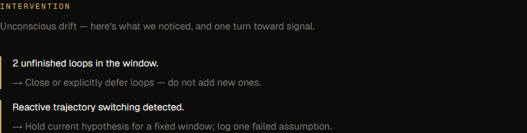
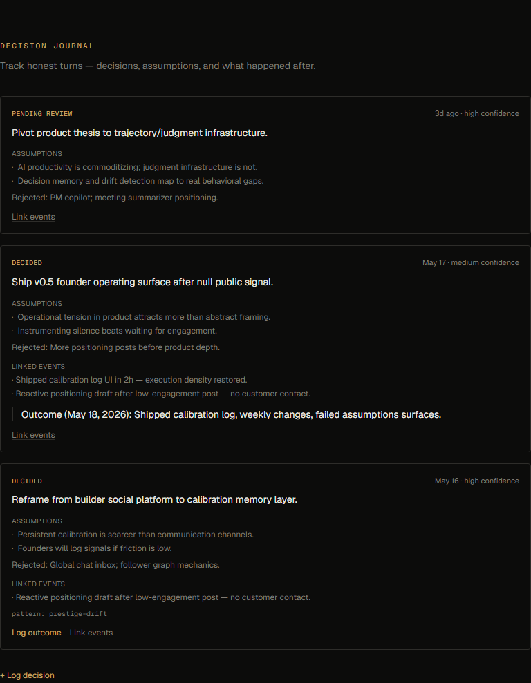
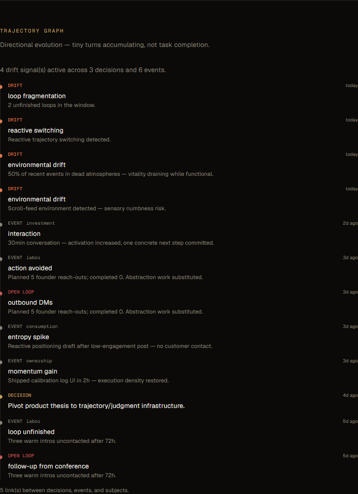
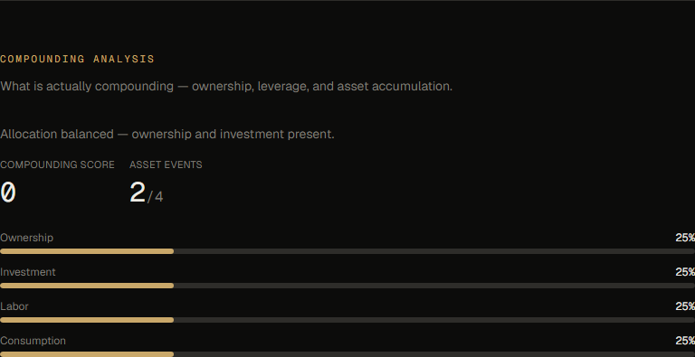
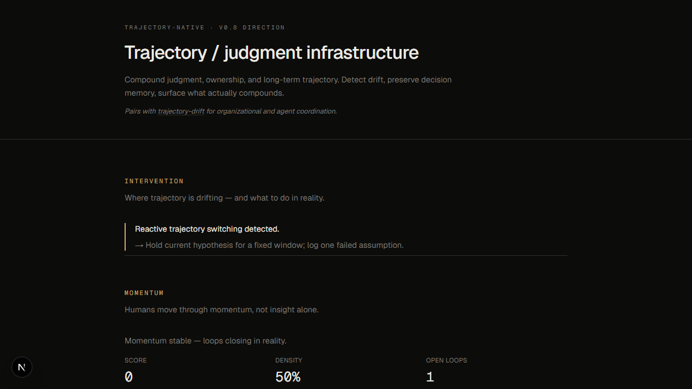

# trajectory-native

**A trajectory-aware human environment system.**  
Most people don't collapse — they **drift quietly**, often in dead environments. Notice, steer with intention, restore aliveness.

> Not productivity. Not "return to normal." Navigation through environment, emotion, and direction.

**trajectory-native** — personal steering (human-side).  
**[trajectory-drift](https://github.com/higuseonhye/trajectory-drift)** — drift detection (system-side).

Thesis: [product direction](docs/product-direction.md) · [steering](docs/steering.md) · [environment & state](docs/environment-design.md) · [framework](framework/)

<p align="center">
  
</p>

---

## Why this exists

People rarely collapse all at once. They **drift quietly** — unconscious inertia, signal loss, and direction fade while still looking functional. **Dead environments accelerate drift:** fluorescent survival, scroll loops, sterile routines, sensory deprivation.

Most tools push optimization. Few help you ask: **am I steering, or just functioning?** And fewer still ask: **what environment would help me feel alive enough to choose?**

---

## What this is

Not a dashboard. Not a habit tracker. Not optimization software.

A **personal navigation system** for steering trajectory — through cognition, **state**, and **environment**.

| Surface layer | Depth layer |
|---------------|-------------|
| Drift detection · daily steering · vitality · **environment** | Compounding · judgment · ownership |
| "What's one tiny turn?" (including environmental) | Decision memory · trajectory graph |
| Emotional honesty · embodied state | Systems intelligence |

| Capability | Role |
|------------|------|
| **Decision Memory** | Preserve decisions, rationale, tradeoffs, commitments |
| **Drift Detection** | Prestige loops, fragmentation, low-leverage activity |
| **Compounding Analysis** | Surface what actually compounds |
| **Ownership Layer** | Assets, leverage, ownership trajectory |

| Module (v0.8 shipped) | Role |
|-----------------------|------|
| **Capital & leverage reflection** | Dependency, optionality, ownership trajectory |
| **Trajectory graph** | Unified timeline — decisions, events, loops, drift |
| **Institutional memory** | Team decisions bridged from org-reasoning-mvp |
| **Compounding analysis** | Ownership/labor/consumption allocation trends |
| **Decision journal** | Personal judgment + event linking |
| **Trajectory events** | Atomic unit — interactions, momentum, entropy, allocation |
| **Momentum engine** | Density, open loops, interaction energy, recovery |
| **Intervention / Drift Radar** | Unconscious drift surfaced — one turn toward signal |
| **Interaction intelligence** | Amplifiers vs drains |
| **Native ↔ drift bridge** | Export events for unified analysis |

See [framework/product-mapping/](framework/product-mapping/) for full module architecture.

---

## Founder drift → intervention

Recurring patterns now drive **intervention signals**, not only reflection:

- interaction starvation
- momentum degradation
- unfinished loops
- reactive trajectory switching
- abstraction over action

Archive: [`docs/calibration-archive.md`](docs/calibration-archive.md)

---

## Reality loop

```
reflection → action → environment → feedback → recalibration
```

The loop must close in the world — not stop at insight.

---

## Run locally

```bash
npm install && npm run dev
# → http://localhost:3000
```

Surfaces at top of page: **Intervention** · **Momentum** · **Compounding** · **Capital & leverage** · **Trajectory graph** · **Decision journal** · **Institutional memory** · **Interaction intelligence** · **Events** · **Bridge**.

---

## Screenshots

<p align="center">
  
  
</p>

<p align="center">
  
  
</p>

<p align="center">
  
</p>

Full scroll: [`demo-full.png`](docs/screenshots/demo-full.png)

---

## Ecosystem

| Repo | Layer |
|------|--------|
| **trajectory-native** (this repo) | Personal trajectory OS |
| **[trajectory-drift](https://github.com/higuseonhye/trajectory-drift)** | Human + AI coordination infrastructure |

---

## Docs

- [`docs/product-direction.md`](docs/product-direction.md) — current thesis
- [`docs/steering.md`](docs/steering.md) — emotional layer (drift, rudder, signal contact)
- [`framework/steering/`](framework/steering/) — steering concepts
- [`docs/trajectory-infrastructure.md`](docs/trajectory-infrastructure.md)
- [`docs/calibration-archive.md`](docs/calibration-archive.md)
- [trajectory-drift/framework/](https://github.com/higuseonhye/trajectory-drift/tree/main/framework) — drift taxonomy, signals, recovery

---

## Status

`v0.9` direction — trajectory-aware OS: emotional steering surface + systems depth underneath. Early. Evolving in public.

### org-reasoning-mvp bridge

Set `ORG_REASONING_URL=http://localhost:3000` when org-reasoning-mvp is running. Team decisions load live; otherwise seed data displays.
