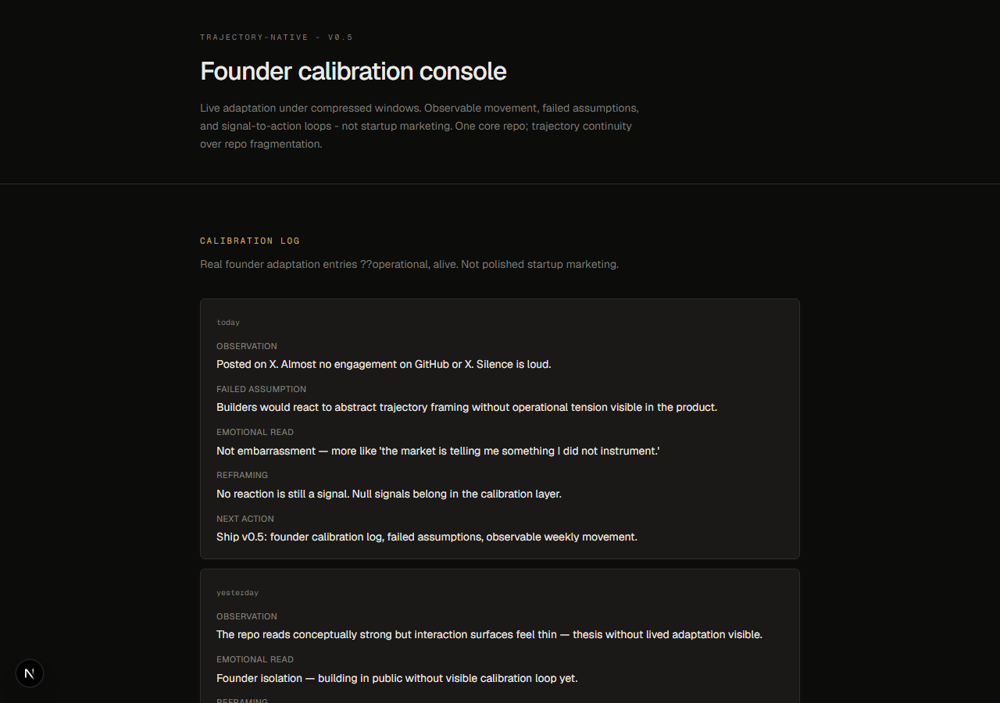

# trajectory-native

**Human trajectory infrastructure.**  
A calm operating system to **sustain desired trajectory under entropy**.

> Sustain momentum. Reduce drift. Preserve trajectory.

**trajectory-native** — personal trajectory OS (human-side).  
**[trajectory-drift](https://github.com/higuseonhye/trajectory-drift)** — organizational + agent coordination (system-side).

Thesis: [trajectory infrastructure](docs/trajectory-infrastructure.md)

<p align="center">
  
</p>

---

## Why this exists

Humans do not fail primarily from lack of intelligence. They fail from **trajectory drift** under entropy, isolation, weak interaction loops, and broken momentum systems.

Most tools optimize execution or reflection. Few sustain **momentum, interaction, and closed reality loops**.

---

## What this is (v0.6 direction)

Not a journaling app. Not a thinking tool.

| Layer | Role |
|-------|------|
| **Trajectory events** | Atomic unit — interactions, avoided actions, momentum, entropy |
| **Momentum engine** | Density, open loops, interaction energy, recovery |
| **Intervention** | Where drift is detected; what to do in reality |
| **Interaction intelligence** | Who/what increases or drains momentum (amplifiers vs drains) |
| **Event ingestion** | Calendar · comms · tools · JSON adapters |
| **Native ↔ drift bridge** | Export events for unified system-side analysis |
| **Calibration log** | Founder adaptation archive |

---

## Founder drift → intervention

Recurring patterns now drive **intervention signals**, not only reflection:

- interaction starvation
- momentum degradation
- unfinished loops
- reactive trajectory switching
- abstraction over action

Archive: [`docs/calibration-archive.md`](docs/calibration-archive.md)

---

## Reality loop

```
reflection → action → environment → feedback → recalibration
```

The loop must close in the world — not stop at insight.

---

## Run locally

```bash
npm install && npm run dev
# → http://localhost:3000
```

Surfaces at top of page: **Intervention** · **Momentum** · **Trajectory events** · calibration log.

---

## Ecosystem

| Repo | Layer |
|------|--------|
| **trajectory-native** (this repo) | Personal trajectory OS |
| **[trajectory-drift](https://github.com/higuseonhye/trajectory-drift)** | Human + AI coordination infrastructure |

---

## Docs

- [`docs/trajectory-infrastructure.md`](docs/trajectory-infrastructure.md)
- [`docs/calibration-archive.md`](docs/calibration-archive.md)
- [`docs/adaptive-coherence.md`](docs/adaptive-coherence.md) — prior shared thesis
- [trajectory-drift — organizational trajectory](https://github.com/higuseonhye/trajectory-drift/blob/main/docs/organizational-trajectory.md)

---

## Status

`v0.6` direction — trajectory events + momentum + intervention shipped in UI. Early. Evolving in public.
